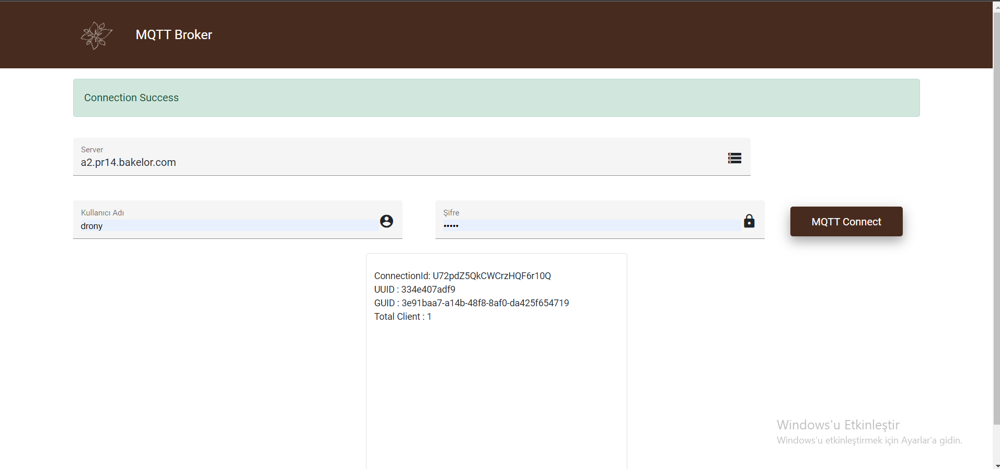
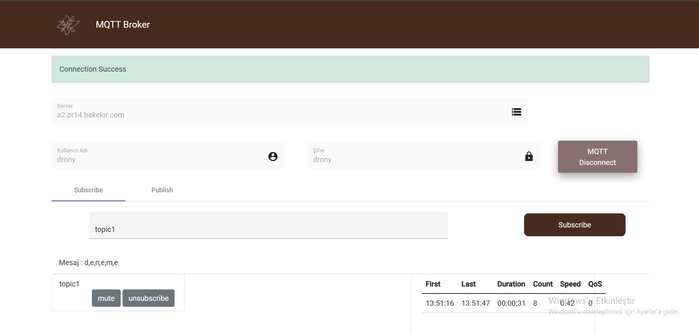

# MQTTBroker
Angular - SignalR - MQTT
- Uygulamanın ön yüz ve arka yüz olmak üzere iki kısmı vardır.
- Angular ön yüzünde kullanıcılar MQTT'ye bağlanır.
- Kullanıcılar bir topic'i dinleyebilir isteğe göre dinledikleri topic'i durdurup
    devam ettirebilirler, ya da dinledikleri topicleri kaldırabilirler.
- Ekranda dinlenen topic'e gore mesajın göndereildiği ilk saniye, mesajın gönderildiği son saniye
    arada geçen zaman, gelen mesaj sayısı, saniyede kaç mesaj geldiği, QoS leveli, ve son gönderilen mesaj yazdırılır.
-# - 

 
 